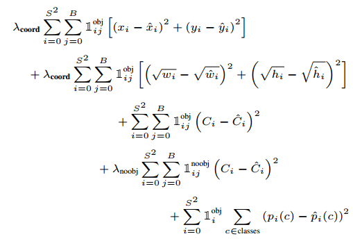

# YOLOv1 — You Only Look Once: Real-Time Object Detection

This project is a PyTorch re-implementation of the YOLOv1 (You Only Look Once) object detection architecture, based on the original paper:
**"You Only Look Once: Unified, Real-Time Object Detection"** by Joseph Redmon et al.

---

## Introduction

Object detection aims to locate objects in an image and classify them. Traditional pipelines like **R-CNN**, **Fast R-CNN**, and **Faster R-CNN** treat detection as a two-step process:
1. Propose potential object regions
2. Run classification on each region

While accurate, these methods are slow and often involve complex pipelines.

---

## Why YOLO?

YOLO reframes object detection as a **single regression problem** — from image pixels **directly to bounding box coordinates and class probabilities**.

- **Fast**: One forward pass for the entire image — real-time detection.
- **Global reasoning**: Unlike region-based methods that look at parts, YOLO sees the full image during training and inference.
- **Unified**: No need for external region proposal networks.

---

## YOLOv1 Architecture and Pipeline

YOLOv1 divides the input image into an \( S \times S \) grid (typically \( S = 7 \)).

- Each grid cell is responsible for detecting objects whose **center falls into that cell**.
- Each grid cell predicts:
  - \( B \) bounding boxes (typically \( B = 2 \))
  - Confidence score for each box: how likely it contains an object and how accurate it is.
  - Class probabilities \( C \) for \( C \) classes (shared across boxes in that cell)

### Output Vector Size per Grid Cell:
\[
\text{(B × 5)} + C
\]
Where:
- 5 = \( x, y, w, h, \text{confidence} \)

### Full output tensor:
\[
S \times S \times (B \times 5 + C)
\]

---

## Network Architecture

- **24 convolutional layers** for feature extraction (inspired by GoogLeNet)
- **2 fully connected layers** for regression and classification output

Input image size: **448 × 448**

---

## Mathematical Intuition

Let:
- \( (x, y) \): center of the bounding box, relative to the bounds of the grid cell (values ∈ [0, 1])
- \( (w, h) \): width and height, relative to the full image
- \( C \): confidence score = \( P(\text{object}) \times \text{IoU}_{\text{pred, truth}} \)

Each loss term is weighted to emphasize:
- Localization accuracy for bounding boxes
- Classification confidence
- Penalties for predicting boxes where there are no objects

### 🔍 YOLO Loss Function

The total loss is a sum of multiple terms:

  

<!--  -->

The square root on width/height helps normalize large objects vs small ones. The selective activation of terms ensures the model learns only from responsible boxes.

---

## What I Implemented

### Model Architecture:
- A full **YOLOv1 CNN** with:
  - 24 convolutional layers
  - Flatten + fully connected layers to predict bounding boxes + classes

### Loss Function:
- A custom YOLO loss that:
  - Assigns box responsibility based on highest IoU
  - Applies coordinate, confidence, and classification loss
  - Handles `noobj` cells with reduced weight

### Not Implemented:
- Dataset loading & training pipeline (e.g. Pascal VOC)
- Bounding box visualization & mAP evaluation

This repo focuses on **understanding the architecture and math**, not on full end-to-end training.

---

## Reference

[You Only Look Once: Unified, Real-Time Object Detection (YOLOv1 Paper)](https://arxiv.org/abs/1506.02640)

---
